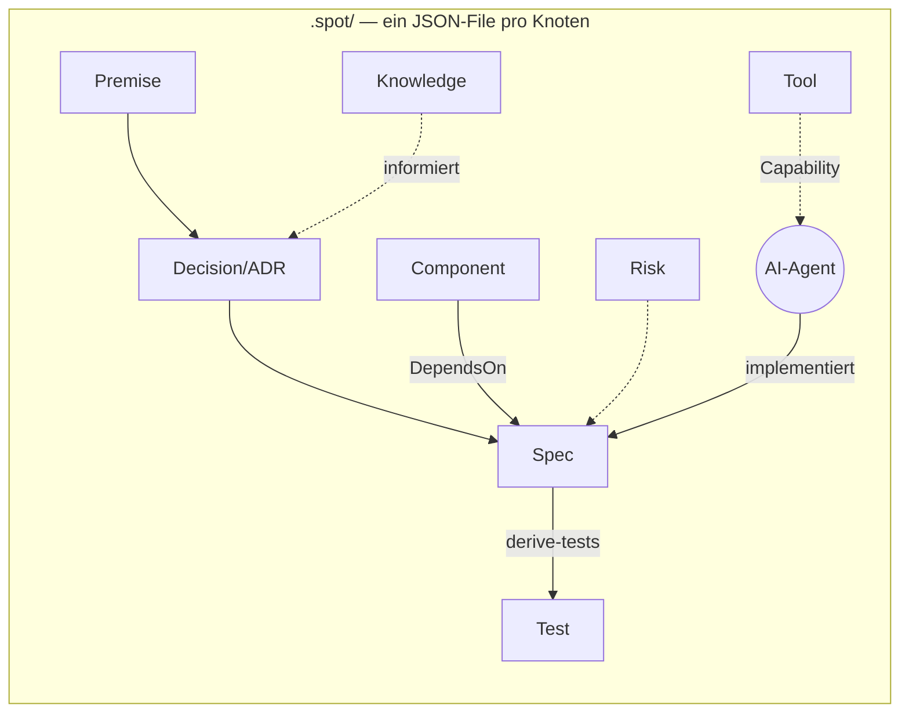

# Architektur

## Das SPOT-Prinzip

Alles ist ein Knoten im selben Graphen — Code, Tests, Risiken, Entscheidungen,
Wissen und Werkzeuge sind **Abbildungen (Morphismen) derselben Sache**:

Jeder Knoten trägt einen **Convergence**-Status gegen die Implementierung:
`Pending` (Modell ohne Code) → `Aligned` (synchron) → `Diverged` (Drift) →
`Orphaned` (Code ohne Modell).

## Projekte

| Projekt | Rolle |
|---|---|
| `Cdd.Core` (F#) | Domain: SPOT-Typen als Discriminated Union, JSON-Persistenz, Validierung, Drift-Report, Spec→Test-Ableitung |
| `Cdd.Cli` (F#) | `cdd init\|list\|validate\|diff\|derive-tests` |
| `Cdd.Web` (F#) | Cockpit: REST-API + statisches Frontend (Editor, Mermaid-Graph, Panels); Demo-Modus ohne Backend via localStorage |
| `Cdd.Tests` | xUnit: Round-Trips, Validierungsregeln, Ableitung, Store-Sicherheit |

## Design-Entscheidungen

- **F#-DUs statt Schema-Dateien:** Das Typsystem *ist* das Schema; illegale
  Zustände sind nicht repräsentierbar.
- **Ein JSON-File pro Knoten:** git-diffbar, merge-freundlich, kein DB-Server.
- **Frontend ohne Build-Schritt:** ES-Module + Mermaid via CDN; die einzige
  Logik-Duplizierung ist der bewusst vereinfachte Demo-Modus (`demo.js`).
- **Id = Dateiname:** strikt validiert (`[a-zA-Z0-9][a-zA-Z0-9_-]*`),
  Path-Traversal damit ausgeschlossen.

## Deployment-Topologie

GitHub ist die Drehscheibe: CI prüft, Releases liefern Binaries, GHCR liefert
das Container-Image, Pages hostet die öffentliche Demo, eine VM zieht
`main` per Pull-Deploy (Details: [devops.md](devops.md)).
