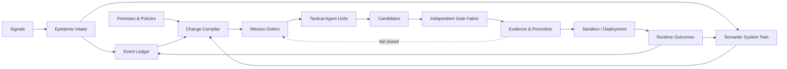

# EIDOS — evidenzgesteuerte Softwareevolution

> **Status:** ausführbarer v0.8-alpha-Kernel bis `ZT2` plus öffentliches
> Architektur- und Forschungsprogramm. Implementiert sind die Phasen 0–6:
> epistemische Claims, System Twin, Mission Orders, Change Compiler, Evidence
> Packs, isolierter OpsLab und Studio. Produktive Selbst-Evolution,
> Outcome-/Strategy-Lernen und automatische Kausalität werden nicht behauptet.

## 1. These

Wir wollen nicht den alten Software Development Life Cycle nur schneller
automatisieren. Wir wollen eine Änderung als überprüfbare Transformation
kompilieren:

```text
Signal
→ Lagebild
→ Risiko- und Unsicherheitsbewertung
→ Change Intent
→ Mission Order
→ Kandidaten
→ unabhängige Assurance
→ Evidence Pack
→ Sandbox/Promotion
→ Outcome
→ Lernen
```

Eine lineare Agentenkette ist dabei nicht die Architektur. Sie ist ein
temporärer, für eine konkrete Lage erzeugter Ausführungsplan.

**EIDOS** ist der Arbeitsname für dieses doctrine-getriebene
Command-and-Control-System für Softwareevolution. CDD enthält seinen ersten
kleinen und falsifizierbaren Kernel; dessen Autorität endet hart bei einer
lokalen, credential-freien `ZT2`-Sandbox.

## 2. Warum der heutige SPOT nicht genügt

Der CDD-SPOT ist eine starke Referenz für Spezifikationen, Risiken,
Entscheidungen, Tests und Komponenten. Der Name „Single Point of Truth“ darf
aber nicht bedeuten, dass jeder gespeicherte Satz automatisch wahr ist.

EIDOS entwickelt den SPOT deshalb zu einem **Single Point of Authority über
typisierte Wahrheitsansprüche** weiter. Für jeden Claim müssen mindestens
Provenienz, Gültigkeitsbereich, Zeitpunkt und epistemischer Status bekannt
sein.

| Status | Bedeutung |
|---|---|
| `Observed` | direkt gemessene Beobachtung |
| `Declared` | Aussage einer Quelle, noch nicht unabhängig bestätigt |
| `Inferred` | aus Daten oder Modellen abgeleitete Aussage |
| `Proposed` | vorgeschlagene Änderung oder Interpretation |
| `Ratified` | durch eine zuständige Autorität angenommene Setzung |
| `Verified` | gegen ein benanntes Orakel in einer benannten Umgebung geprüft |
| `Contested` | widersprochen; Konflikt bleibt sichtbar |
| `Deprecated` | historisch erhalten, aber nicht mehr gültig |
| `OutcomeConfirmed` | nach Deployment durch gemessenes Outcome bestätigt |

Originalsignal, maschinelle Interpretation und ratifizierte Modelländerung
bleiben getrennt. `Unknown` ist ein eigener Zustand und wird niemals als
„nicht betroffen“ interpretiert.

## 3. Kernmodell

Die zentrale Operation ist ein Change Compiler:

```text
Compile(Intent, Twin_t, Policies, Evidence_t)
  → { Candidate_1, …, Candidate_n }
```

Ein Kandidat ist mehr als ein Code-Diff:

```text
Candidate =
  SemanticDelta
  + ArtifactChanges
  + AssuranceObligations
  + Evidence
  + DeploymentPlan
  + RecoveryPlan
```

### Kernartefakte

| Artefakt | Zweck |
|---|---|
| `Signal` | unverändertes Rohereignis aus Nutzerfeedback, Runtime, Git, Betrieb, Simulation oder Analyse |
| `Claim` | atomisierte, epistemisch typisierte Aussage mit Provenienz |
| `Premise` | normative Setzung; nicht mit einer Beobachtung zu verwechseln |
| `ChangeIntent` | gewünschte Wirkung, Grenzen und Erfolgskriterien |
| `SystemTwin` | zeitbezogene Projektion des bekannten Systems, einschließlich Unsicherheit |
| `HazardAssessment` | Risikovektor und benötigte Assurance-Tiefe |
| `MissionOrder` | Auftrag, Mittel, Grenzen, Berichtspflichten und Abbruchkriterien |
| `Candidate` | mögliche Systemänderung samt Obligations und Recovery |
| `Evidence` | reproduzierbarer Nachweis eines benannten Orakels |
| `Decision` | Promotion-, Eskalations- oder Abbruchentscheidung |
| `Outcome` | nach der Änderung beobachtete Wirkung |
| `Strategy` | versionierte Dispatch-/Assurance-Politik, deren Leistung gemessen wird |

## 4. Zielarchitektur



### Sechs Ebenen

1. **Sovereignty Plane**
   Ziele, Prämissen, Verbote, Zuständigkeiten und Risikotoleranz.
2. **Epistemic & Semantic Plane**
   Signale, Claims, Provenienz, Ontologie, SPOT und System-Twin.
3. **Control Plane**
   Lageklassifikation, Dispatch, Budgets, Rechte, Eskalation und Abbruch.
4. **Synthesis Plane**
   Code-, Daten-, API-, Test-, Dokumentations- und IaC-Kandidaten.
5. **Assurance Plane**
   unabhängige Tests, Properties, Fuzzing, Simulation, Policy-Checks und
   formale Beweise, soweit die Risikoklasse sie verlangt.
6. **Runtime & Evolution Plane**
   kontrollierter Rollout, Observability, Recovery, Outcome-Messung und
   versioniertes Lernen.

## 5. Operational Doctrine

EIDOS übernimmt Begriffe aus Einsatzführung und Auftragstaktik als
**Softwaremetapher mit eigener maschinenlesbarer Semantik**. Es kopiert keine
Feuerwehrdienstvorschrift und macht daraus keinen Softwarestandard.

| Operationsbegriff | EIDOS-Semantik |
|---|---|
| Lagebild | aktuelle Twin-Projektion samt Unsicherheit |
| Einsatzstichwort | Change-/Incident-Klasse |
| Gefahrenmatrix | mehrdimensionaler Risikovektor |
| Alarm- und Ausrückeordnung | versionierte Dispatch Policy |
| taktische Einheit | Capability-Bündel aus Agent, Tools, Kontext, Rechten und Budget |
| Einsatzauftrag | typisierte `MissionOrder` |
| Lagemeldung | zeitgestempelter, evidenzbelegter Fortschrittsbericht |
| Nachalarmierung | zusätzliche Capability oder unabhängiges Orakel |
| Rückzug | Abbruch, Rollback oder sichere Degradation |
| Nachbesprechung | Outcome Review und Doctrine-Änderung |

### Mission Order

Eine Mission Order bestimmt das Ziel und die Grenzen, nicht jeden
Implementierungsschritt:

```yaml
mission:
  situation: "Welche Änderung oder Störung liegt vor?"
  intent: "Welche beobachtbare Wirkung soll eintreten?"
  scope: ["betroffene Capabilities und Schnittstellen"]
  constraints: ["Policies", "Budgets", "Kompatibilität"]
  unit: ["benötigte Fähigkeiten und Werkzeuge"]
  obligations: ["Tests", "Security", "Performance", "Recovery"]
  reporting: ["wann und mit welcher Evidenz melden?"]
  success: ["messbare Promotion-Kriterien"]
  abort: ["harte Stop- und Eskalationsbedingungen"]
```

### Standing Orders

- Kein Agent autorisiert seine eigene Promotion.
- Generator und kritisches Orakel müssen organisatorisch oder technisch
  dekorreliert sein.
- Externe Schnittstellen brauchen Kompatibilitätsevidenz.
- Produktivänderungen brauchen Observability und einen getesteten
  Recovery-Pfad.
- Evidenz ist versions-, zeit- und umgebungsgebunden.
- Widerspruch und Unsicherheit werden sichtbar gemacht, nicht geglättet.
- Nicht erfüllte Obligations führen zu `fail closed`.

## 6. Risiko steuert Autonomie

Die Gefahrenbewertung ist kein einzelner Score, sondern mindestens ein Vektor
über:

- funktionale Korrektheit,
- Datenintegrität,
- Security und Datenschutz,
- Verfügbarkeit,
- externe Contracts,
- regulatorische Wirkung,
- Performance und Determinismus,
- Irreversibilität,
- Blast Radius,
- epistemische Unsicherheit,
- Zuverlässigkeit der eingesetzten Agenten und Orakel.

Autonomie wird nicht global aktiviert, sondern pro Mission verdient:

| Stufe | Zulässiger Bereich |
|---|---|
| `ZT0` | Analyse und Vorschlag |
| `ZT1` | autonomer Candidate Branch |
| `ZT2` | autonome, isolierte Sandbox |
| `ZT3` | kontrollierte Non-Production-Umgebung |
| `ZT4` | eng begrenzte Low-Risk-Produktion mit Auto-Rollback |
| `ZT5` | kontinuierliche Evolution innerhalb fester Policies |
| `ZT6` | kontrollierte Meta-Evolution von Strategien und Werkzeugen |

Das erste belastbare Ziel ist `ZT2`, nicht „menschenlose Produktion“.

## 7. Trusted Kernel und unabhängige Assurance

Die generative Ebene darf nicht zugleich alle Regeln, Orakel und
Promotion-Entscheidungen kontrollieren. Ein kleiner Trusted Kernel erzwingt:

- Identität, Rechte und Capability-Allowlists,
- unveränderliche Mission- und Policy-Versionen während eines Laufs,
- Trennung von Generator, Validator und Promoter,
- signierte oder zumindest content-addressed Evidence Packs,
- Zeit-, Versions- und Umgebungsbindung von Evidenz,
- Budget-, Iterations- und Timeout-Grenzen,
- sichere Sandboxes ohne produktive Credentials,
- atomaren Abbruch und getesteten Rollback,
- ein append-only Event Ledger für Replay und Audit.

Ein „grüner“ Validator beweist nur die geprüfte Eigenschaft. Er beweist nicht,
dass die richtige Eigenschaft gewählt wurde. Genau deshalb bleiben
Provenienz, konkurrierende Hypothesen und normative Prämissen First-Class
Artifacts.

## 8. Evolutionary Engineering Memory

Ein Data Warehouse allein ist noch kein Weltmodell:

- das Ledger speichert,
- das Warehouse aggregiert,
- der Twin repräsentiert,
- ein Kausalmodell erklärt,
- ein Agent handelt.

Die Anreicherungskette lautet:

```text
Raw Signal
→ normalized Event
→ Claim
→ Context
→ Pattern
→ Hypothesis
→ Change Option
→ Experiment
→ Evidence
→ Outcome
→ retained Knowledge
```

Lernen ist erst zulässig, wenn Outcome, Intervention und mögliche
Störfaktoren getrennt erfasst sind. Korrelation wird nicht als Ursache
gespeichert. Alte Evidenz verfällt oder wird bei geänderter Umgebung
herabgestuft.

## 9. Studio und Simulator

EIDOS Studio ist keine Chat-Oberfläche mit zusätzlichen Tabs. Der headless
Kernel bleibt die Autorität; die Oberfläche bietet mehrere Projektionen:

- **Engineering IDE:** Intent Editor, System Map, Semantic Diff, Impact Lens,
  Evidence Matrix und Runtime Traces.
- **Tactical View:** Lagekarte, Fog of War, Missionsziele, Einheiten,
  Nachalarmierung, Retreat und Replay.
- **Planning View:** Change-Flüsse, Kapazitäten, Gate-Engpässe, Evidence Debt,
  Kosten und Durchsatz.
- **Incident View:** Einsatzklasse, Gefahrenmatrix, Abschnitte,
  Lagemeldungen und Recovery.

Die Spielmetapher ist eine Projektion, nicht der Kern. Der Simulator dient
gleichzeitig als Demo, Trainingsumgebung und reproduzierbarer Benchmark.

## 10. Open Source und private Profile

Das öffentliche Upstream kennt niemals ein konkretes internes Downstream.

| Öffentlich in CDD/EIDOS | Bleibt im jeweiligen Downstream |
|---|---|
| Metamodell und Protokolle | reale Systemmodelle und Telemetrie |
| Mission-/Evidence-Verträge | produktive Change Requests |
| Plugin- und Gate-Schnittstellen | proprietäre Adapter und Policies |
| synthetische Profile | Zugangsdaten, interne Routen und Kundendaten |
| generische Algorithmen | produktive Evidence Packs |
| reproduzierbare Benchmarks | interne Agenten- und Toolrechte |

Die Erweiterung erfolgt über Inversion of Control. Private Systeme verwenden
das öffentliche Framework; das Framework enthält keine Rückreferenz auf sie.

## 11. Forschungsprogramm

### Kernfragen

1. Wie werden aus einem semantischen Delta automatisch risikoadaptive
   Assurance Obligations abgeleitet?
2. Wie lässt sich die Kalibrierung eines unvollständigen System-Twins messen?
3. Wie stark müssen Generator und Orakel dekorreliert sein, damit Evidence
   belastbar bleibt?
4. Verbessert dynamischer, doctrine-getriebener Dispatch Qualität, Kosten und
   Nachvollziehbarkeit gegenüber einer festen Agentenkette?
5. Wie werden Outcomes kausal genug zugeordnet, ohne Korrelation als Lernen
   auszugeben?
6. Wann darf eine Strategy auf Grundlage früherer Missionen verändert werden?

### Messgrößen

- **Human Mechanical Touch Count:** menschliche Aktionen pro Change, die
  weder kreative Modellbildung noch normative Entscheidung sind.
- Gate Escape Rate und nachträglich gefundene Defekte.
- Falsification Yield pro Orakel und Risikoklasse.
- Kalibrierungsfehler zwischen Twin-Konfidenz und Realität.
- Evidence Freshness und Anteil wiederverwendbarer Evidenz.
- Lead Time, Compute-/Token-Kosten und Rollback-Zeit.
- Reproduzierbarkeit und vollständiges Mission Replay.

### Benchmark-Idee: EvoSDLC-Bench

Ein öffentlicher Benchmark soll nicht nur Endzustände prüfen, sondern eine
Folge veränderlicher Anforderungen, Gegenbeispiele und Runtime-Outcomes. Ein
System wird daran gemessen, ob es:

- Widersprüche und Unknowns sichtbar hält,
- passende Obligations auswählt,
- falsche Kandidaten früh verwirft,
- alte Evidenz korrekt entwertet,
- nach Outcomes seine Strategie verbessert, ohne Policies zu umgehen.

## 12. Roadmap

| Phase | Ergebnis | Promotion-Gate | Stand |
|---|---|---|---|
| 0 | Constitution, Glossar, Risiken und Forschungsfragen im SPOT | Modell validiert | ✅ v0.8 |
| 1 | EIDOS-Core-Verträge als F#-DUs | Roundtrip + automatisierte Tests | ✅ v0.8 |
| 2 | Read-only System Twin mit Provenienz und Unsicherheit | reproduzierbare Projektion | ✅ v0.8 |
| 3 | Change Compiler v0 für einen synthetischen Change | deterministischer Candidate | ✅ v0.8 |
| 4 | Gate Fabric und Evidence Pack | unabhängiger grüner/roter Nachweis | ✅ v0.8 |
| 5 | autonomer OpsLab-Lauf auf `ZT2` | Sandbox, Abbruch und Replay | ✅ v0.8 |
| 6 | Studio/Sim als Projektion desselben Kernmodells | Browser-Smoke + API-Modellgleichheit | ✅ v0.8 |
| 7 | Outcome Loop und versionierte Strategy-Auswertung | keine Kausalitäts-Overclaims | 🔜 offen |
| 8a | Assurance-Fault-Injection gegen Feature-Baseline | reproduzierbarer Construct Test | ✅ v0 |
| 8b | externer EvoSDLC-Bench gegen reale Baselines | preregistrierte, reproduzierbare Studie | 🔜 offen |

Der erste Demonstrator ist eine synthetische Report-/Submission-Plattform:
versionierte Formate, deterministische Validierung, Reports, Auditlog und ein
abwärtskompatibler Feld-Change. Das Zielsystem bleibt deterministisch; die
Agentik liegt im Engineering-Prozess, nicht im produktiven Hot Path.

## 13. Ist und Ziel sauber getrennt

| Capability | Stand im Repository |
|---|---|
| typisierter, git-versionierter SPOT | implementiert |
| Konvergenz gegen Tests und grünes Gate | implementiert |
| CLI, MCP und experimentelles Cockpit | implementiert |
| epistemische Claim-Typen und Provenienz | v0 implementiert |
| Mission Orders und Doctrine-Dispatch | v0 bis `ZT2` implementiert |
| Change Compiler | deterministischer synthetischer v0 implementiert |
| Evidence Packs und Promotion Policy | content-addressed v0 implementiert |
| Zero-Touch-Sandbox | synthetischer OpsLab auf `ZT2` implementiert |
| EIDOS Studio | mobile-first PWA mit Run, Fault Injection, Replay und Feedback-Export |
| EvoSDLC-Bench | v0 Construct Test; keine externe Validität behauptet |
| Outcome- und Strategy-Lernen | Forschungsziel |
| AGI | weder Zielbehauptung noch Ergebnis |

## 14. Forschungsnachbarn

EIDOS beansprucht nicht, seine Einzelideen erfunden zu haben. Es integriert
bekannte Forschungslinien zu Intent-Formalisierung, externen Verifizierern,
Spezifikationsqualität, Agenten-Evolution und Softwaregedächtnis:

- Shuvendu K. Lahiri:
  [Intent Formalization: A Grand Challenge for Reliable Coding in the Age of AI Agents](https://arxiv.org/abs/2603.17150),
  2026.
- Margaret-Anne Storey:
  [From Technical Debt to Cognitive and Intent Debt](https://arxiv.org/abs/2603.22106),
  2026.
- Md Rakib Hossain Misu, Iris Ma, Cristina V. Lopes:
  [VeriAct: Beyond Verifiability](https://arxiv.org/abs/2604.00280),
  2026.
- Subbarao Kambhampati et al.:
  [LLMs Can't Plan, But Can Help Planning in LLM-Modulo Frameworks](https://arxiv.org/abs/2402.01817),
  2024.
- Jenny Zhang et al.:
  [Darwin Gödel Machine](https://arxiv.org/abs/2505.22954),
  2025.
- Alex Iacob et al.:
  [The Red Queen Gödel Machine](https://arxiv.org/abs/2606.26294),
  2026.
- Manoel Salgado Neto et al.:
  [Collaborative and AI-Supported Requirements Elicitation](https://arxiv.org/abs/2606.24060),
  2026.
- Lekshmi Murali Rani et al.:
  [AI for Requirements Engineering: Industry adoption and Practitioner perspectives](https://arxiv.org/abs/2511.01324),
  2025/2026.
- Jinwei Hu et al.:
  [Responsible Agentic AI Requires Explicit Provenance](https://arxiv.org/abs/2605.17169),
  2026.
- Xing Zhang et al.:
  [Who Grades the Grader?](https://arxiv.org/abs/2607.12790),
  2026.
- Thomas Kwa et al.:
  [Measuring AI Ability to Complete Long Software Tasks](https://arxiv.org/abs/2503.14499),
  2025/2026.
- W3C:
  [PROV-O: The PROV Ontology](https://www.w3.org/TR/prov-o/).
- OpenSSF:
  [SLSA Provenance](https://slsa.dev/spec/v1.2/).
- NIST:
  [SP 800-218 Secure Software Development Framework](https://csrc.nist.gov/pubs/sp/800/218/final).

Die verteidigbare Forschungsleistung wäre nicht „die erste autonome
Softwareentwicklung“, sondern eine präzise, falsifizierbare Integration:

> **Epistemically typed, evidence-governed change compilation with
> risk-adaptive assurance obligations.**

Ob diese Integration gegenüber einfacheren Baselines einen messbaren Vorteil
liefert, ist eine Forschungsfrage — kein vorweggenommenes Ergebnis.

Methodik, Befunde, reproduzierbare v0-Messung und Grenzen sind im
**[Forschungsbericht](eidos-research-report.md)** dokumentiert.
